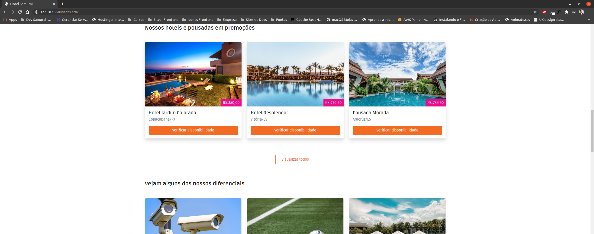
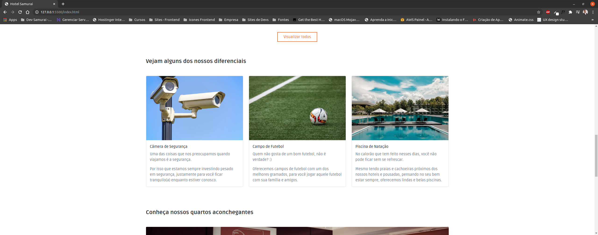
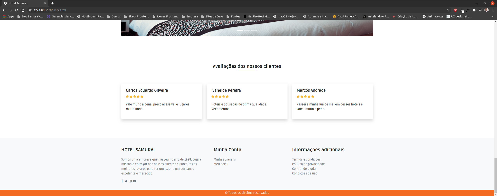

Olá, tudo bem?

Fico agradecido e feliz por você está por aqui vendo um dos meus projetos.

As tecnologias que estão sendo usadas neste projeto são:

1. Bootstrap (V5).
2. CSS.
3. JavaScript.

Segue abaixo alguns screenshots do projeto:

